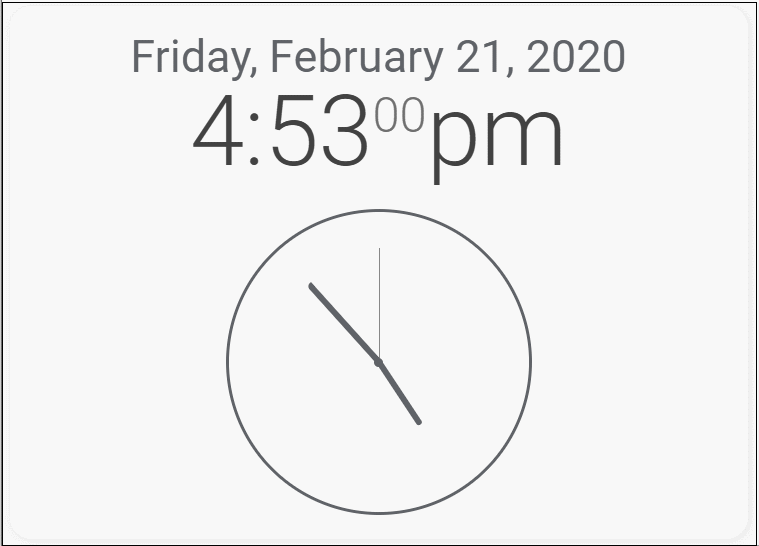

# MM2 Clock Card by [@shbatm](https://www.github.com/shbatm)

Digital/Analog Clock Card for Home Assistant Lovelace based on the [MagicMirror2](https://magicmirror.builders/) Clock

This is a direct port of the [MagicMirror2 Clock](https://github.com/MichMich/MagicMirror/tree/master/modules/default/clock) to TypeScript and the Home Assistant card. Credit goes to the original contributers to that project and module.

## Screenshot


## Options

The following properties can be configured:

| Option            | Description
| ----------------- | -----------
| `timeFormat`      | Use 12 or 24 hour format. <br><br> **Possible values:** `12` or `24` <br> **Default value:** uses value of _config.timeFormat_
| `displaySeconds`  | Display seconds. <br><br> **Possible values:** `true` or `false` <br> **Default value:** `true`
| `showPeriod`      | Show the period (am/pm) with 12 hour format. <br><br> **Possible values:** `true` or `false` <br> **Default value:** `true`
| `showPeriodUpper` | Show the period (AM/PM) with 12 hour format as uppercase. <br><br> **Possible values:** `true` or `false` <br> **Default value:** `false`
| `clockBold`       | Remove the colon and bold the minutes to make a more modern look. <br><br> **Possible values:** `true` or `false` <br> **Default value:** `false`
| `showDate`        | Turn off or on the Date section. <br><br> **Possible values:** `true` or `false` <br> **Default value:** `true`
| `showWeek`        | Turn off or on the Week section. <br><br> **Possible values:** `true` or `false` <br> **Default value:** `false`
| `dateFormat`      | Configure the date format as you like. <br><br> **Possible values:** [Docs](http://momentjs.com/docs/#/displaying/format/) <br> **Default value:** `"dddd, LL"`
| `displayType`     | Display a digital clock, analog clock, or both together. <br><br> **Possible values:** `digital`, `analog`, or `both` <br> **Default value:** `digital`
| `analogSize`      | **Specific to the analog clock.** Defines how large the analog display is. <br><br> **Possible values:** A positive number of pixels` <br> **Default value:** `200px`
| `analogFace`      | **Specific to the analog clock.** Specifies which clock face to use. <br><br> **Possible values:** `simple` for a simple border, `none` for no face or border, or `face-###` (where ### is currently a value between 001 and 012, inclusive) <br> **Default value:** `simple`
| `secondsColor`    | **Specific to the analog clock.** Specifies what color to make the 'seconds' hand. <br><br> **Possible values:** `any HTML RGB Color` <br> **Default value:** `#888888`
| `analogPlacement` | **Specific to the analog clock. _(requires displayType set to `'both'`)_** Specifies where the analog clock is in relation to the digital clock <br><br> **Possible values:** `top`, `right`, `bottom`, or `left` <br> **Default value:** `bottom`
| `analogShowDate`  | **Specific to the analog clock.** If the clock is used as a separate module and set to analog only, this configures whether a date is also displayed with the clock. <br><br> **Possible values:** `false`, `top`, or `bottom` <br> **Default value:** `top`
| `timezone`        | Specific a timezone to show clock. <br><br> **Possible examples values:** `America/New_York`, `America/Santiago`, `Etc/GMT+10` <br> **Default value:** `none`. See more informations about configuration value [here](https://momentjs.com/timezone/docs/#/data-formats/packed-format/)

## Installation
Download the 'download.zip' folder from the latest release and store it in your configuration/www folder. 

Configure Lovelace to load the card:

```yaml
resources:
  - url: /local/mm2-clock-card.js
    type: module
```
